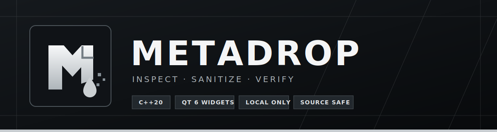

<p align="center">
  
</p>

<p align="center">
  <a href="README.md">English</a> · <a href="README.ru.md"><strong>Русский</strong></a>
</p>

<p align="center">
  <a href="https://github.com/Trendorin/MetaDrop/actions/workflows/ci.yml"></a>
  <a href="https://github.com/Trendorin/MetaDrop/releases/latest"></a>
  <a href="LICENSE"></a>
  
  
</p>

MetaDrop — нативное Linux-приложение для просмотра конфиденциальных метаданных и создания проверенной очищенной копии. Проект написан на C++20 и Qt 6 Widgets, использует системную тему и не передаёт файлы или пути по сети.

<p align="center">
  <a href="https://github.com/Trendorin/MetaDrop/releases/latest"><strong>Скачать последнюю версию</strong></a>
  &nbsp;·&nbsp;
  <a href="SECURITY.md">Безопасность</a>
  &nbsp;·&nbsp;
  <a href="PRIVACY.md">Обработка данных</a>
</p>

## Один понятный процесс

<table>
  <tr>
    <td width="33%"><strong>1. Проверка</strong><br>Добавьте один файл или целую пачку. MetaDrop покажет встроенные поля до любых изменений.</td>
    <td width="33%"><strong>2. Оценка</strong><br>Локация, личность, устройство, время и постоянные идентификаторы получают понятный уровень риска.</td>
    <td width="33%"><strong>3. Очистка</strong><br>Приватная копия очищается, заново открывается и сохраняется только после успешной проверки.</td>
  </tr>
</table>

- Нативный Qt Widgets-интерфейс для KDE Plasma, GNOME, Xfce, Cinnamon и других Linux-окружений.
- Системный трей, drag-and-drop, пакетная обработка, фильтр метаданных и автоматический режим.
- Нет Electron, WebView, аккаунта, телеметрии, аналитики, облака и фонового сетевого клиента.
- В текущей версии исходные файлы никогда не перезаписываются.

## Проверяемая поддержка форматов

MetaDrop честно ограничивает область каждого движка. Неподдерживаемый файл не будет ошибочно помечен очищенным.

| Семейство | Форматы | Что удаляется и проверяется | Граница обработки |
|---|---|---|---|
| Изображения | JPEG, PNG, WebP, TIFF, DNG, HEIC/HEIF, AVIF | EXIF, IPTC, XMP, комментарии и встроенные миниатюры | Для HEIF/AVIF нужна сборка Exiv2 с BMFF. ICC-профиль сохраняется, пока пользователь явно не включит его удаление. |
| Аудио | MP3, FLAC, Ogg Vorbis, Opus, M4A/M4B, MP4, WAV, AIFF | Теги, доступные TagLib, включая текстовые поля и поддерживаемые контейнеры обложек | Временные metadata-треки и видимое содержимое видео не входят в область MP4. |
| PDF | PDF | Document Info, XMP каталога и страниц, PieceInfo, SpiderInfo | Аннотации, формы, вложения и видимое содержимое страниц считаются содержимым документа. |
| Документы | DOCX/XLSX/PPTX, OOXML с макросами, ODT/ODS/ODP и шаблоны | Основные, расширенные и пользовательские свойства, ODF-метаданные, превью, владельцы и внутренние даты архива | Комментарии, история правок, скрытые листы/слайды, макросы и видимый текст не удаляются. |

Технические данные, необходимые для чтения файла — размеры, свойства кодека, структура страниц — показываются отдельно и сохраняются.

## Установка

### AppImage или Debian-пакет

Скачайте `.AppImage` либо `.deb` и файл `SHA256SUMS` со страницы [Releases](https://github.com/Trendorin/MetaDrop/releases/latest). Проверьте файл перед запуском:

```bash
sha256sum --check SHA256SUMS
chmod +x MetaDrop-*.AppImage
./MetaDrop-*.AppImage
```

### Сборка на Fedora

```bash
sudo dnf install gcc-c++ cmake ninja-build \
  qt6-qtbase-devel qt6-qtsvg-devel qt6-qttools-devel \
  exiv2-devel taglib-devel qpdf-devel libarchive-devel

git clone https://github.com/Trendorin/MetaDrop.git
cd MetaDrop
cmake --preset release
cmake --build --preset release
ctest --preset release
cmake --install build/release --prefix "$HOME/.local"
```

### Сборка на Ubuntu 24.04+

```bash
sudo apt install build-essential cmake ninja-build \
  qt6-base-dev qt6-svg-dev qt6-tools-dev \
  libexiv2-dev libtag1-dev libqpdf-dev libarchive-dev

cmake --preset release
cmake --build --preset release
ctest --preset release
```

## Использование

1. Перетащите файлы в окно или откройте их через MetaDrop из файлового менеджера.
2. Выберите файл и изучите поля, найденные его движком.
3. Нажмите **Очистить выбранные** или **Очистить все готовые**.
4. Путь к результату появится в правой панели. Копия `.cleaned` уже повторно открыта и проверена.

Автоматическую очистку можно включить в настройках. Она также создаёт отдельную копию и не отключает проверку.

## Безопасность и приватность

Удаление метаданных уменьшает случайную утечку, но не делает содержимое анонимным. Лицо, адрес, текст документа, имя файла, системные даты, скрытая правка или аккаунт загрузки всё ещё могут раскрыть личность.

Приложение отказывается работать с симлинками и специальными файлами, создаёт staging-файлы с доступом только владельцу, ограничивает размер и число элементов офисных архивов и атомарно сохраняет результат после проверки. Для чувствительных материалов прочитайте [модель безопасности](SECURITY.md) и [политику обработки данных](PRIVACY.md).

## Участие в разработке

Полезны отчёты об ошибках, искусственные тестовые файлы, улучшения доступности и усиление движков. Правила описаны в [CONTRIBUTING.md](CONTRIBUTING.md); список участников формируется по реальным коммитам без выдуманных имён.

## Лицензия

MetaDrop распространяется по лицензии [GPL-3.0-or-later](LICENSE). Авторство и сторонние компоненты перечислены в [CONTRIBUTORS.md](CONTRIBUTORS.md).
